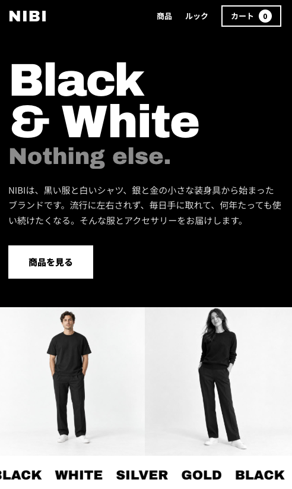

# Portfolio - NIBI

# Over View / 概要

HTML・CSS・JavaScriptの学習を目的として制作した、架空のファッションブランド「NIBI」のECサイトです。

黒と白を基調としたシンプルなデザインに、シルバーとゴールドのアクセサリーを組み合わせ、落ち着いた雰囲気のブランドサイトを制作しました。

*A fictional fashion e-commerce website created for learning and demonstrating HTML, CSS, and JavaScript skills.*

*The website features a minimalist design based on black and white, complemented by silver and gold accessories.*

---

## URL

https://turi-kip.github.io/portfolio-shop001/

---

## Technologies Used / 使用技術

- HTML
- CSS
- JavaScript

---

## Features / 工夫した点

- Responsive design for desktop and mobile devices.
  - PC・スマートフォンの両方に対応したレスポンシブデザイン

- Product listing with detailed product information.
  - 商品一覧から各商品の詳細情報を確認できる機能

- Product detail modal displaying materials and sizes.
  - 商品の素材やサイズなどを確認できる商品詳細モーダル

- Shopping cart functionality.
  - 商品をカートに追加し、購入内容を確認できるカート機能

- Product selection directly from the lookbook images.
  - ルック画像から着用アイテムを直接選択できる機能

- Smooth scrolling navigation between sections.
  - ページ内の各セクションへスムーズに移動できるナビゲーション

- Minimalist visual design using black, white, silver, and gold.
  - 黒・白・シルバー・ゴールドを基調としたミニマルなデザイン

- Consistent typography and spacing to create a sophisticated brand atmosphere.
  - 統一されたタイポグラフィと余白設計による落ち着いたブランドイメージ

---

## Future Improvements / 今後改善したい点

- Add product category filtering and search functionality.
  - 商品カテゴリーによる絞り込みや検索機能の追加

- Add product quantity adjustment and cart total calculation.
  - カート内での商品数量変更や合計金額の計算機能の追加

- Add a checkout and payment flow.
  - 購入手続きや決済までのフローの実装

- Improve accessibility for users with different needs.
  - より幅広いユーザーが利用できるようアクセシビリティを改善

- Optimize image loading and overall page performance.
  - 画像の読み込みやページ全体のパフォーマンスを最適化

- Add more interactive animations to enhance the shopping experience.
  - ショッピング体験をより豊かにするインタラクションやアニメーションの追加
